# `sentinel-firmware`

BLE-connected embedded telemetry and diagnostics platform built on PSoC 6, ModusToolbox, and FreeRTOS with persistent logging, real-time "device_snapshot" telemetry, and OTA-ready architecture.

## Sensors

- BME280 (temperature, humidity, pressure)
- W25Q128 (flash memory)
- DS3231 RTC (for keeping timestamps)
- NF-A4x10 5V PWM fan
- INA-219 Current/Power monitor (for measuring fan current and power consumption)
- TMP117 (fan temperature)

### Primary functions
- Thermally-controlled fan
  - The firmware will control the NF-A4x10 fan.
    - Minimum RPM is set by the user. 
    - If the fan's temperature goes above a set threshold, the fan will automatically increase RPM to cool its load.
  - Fan load temperature is measured by the TMP117. 
  - Fan current/power is measured by the INA-219.
- Environment readings
    - The BME280 reads ambient temperature, humidity, and pressure. 
- OTA DFU
  - Using MCUBoot (CM0+)
- Persistent data storage
    - The W25Q128 will store persistent data, such as:
      - serial number (user-configurable)
      - event log (collection of system event records)
      - recent snapshot history (collection of periodic device snapshots)
      - system preferences
- System Event Log (system_event_record[])
  - discrete events
  - state transitions
  - warnings
  - diagnostics
  - examples (not definitive):
    - firmware_update_event
    - configuration_change_event
    - thermal_event
    - power_event
    - connectivity_event
- Snapshot History
    - Periodic device snapshots
      - Stored in flash and captured at a user-defined interval
      - Can also be captured to a client application via BLE characteristic
- Bluetooth low energy services/characteristics (not definitive, TBA)
  - System Service
    - [read/write] Serial Number
    - [read] Firmware Version
    - [write] Request bootloader mode (for OTA DFU)
  - Sensor Service
    - [read/notify] Ambient Temperature, Humidity, Pressure
    - [read/write] Unix Time
    - [read] Current fan RPM
    - [read/write] User-defined min/max fan RPM
    - [read] Fan voltage
    - [read] Fan power
    - [read/write] User-defined max fan temperature threshold 
    - [read] Fan temperature
  - System Event Log Service
    - [read] System Event Record Count
    - [read/write] System Event Log Index
    - [read/write] System Event Log Block
    - [write] Clear System Event Log Store
  - Snapshot Service
    - [read/notify] Device Snapshot
    - [read/write] Device Snapshot Output Stream Notify Enable

### WIP System Event Record definition

Still trying to figure out how to best handle this.

```cpp
struct system_event_record {
    uint32_t unix_time;

    uint8_t _padding0[3];

    enum event_type : uint8_t {
        firmware_update_attempted,
        firmware_update_successful,
        firmware_update_failed,
        fan_rpm_threshold_change,
        fan_rpm_min_threshold_met,
        fan_rpm_max_threshold_exceeded,
        fan_temperature_threshold_change,
        fan_temperature_min_threshold_met,
        fan_temperature_max_threshold_exceeded,
        fan_power_consumption_exceeded,
        ble_stack_initialized,
        ble_stack_deinitialized,
        ble_peripheral_connected,
        ble_peripheral_disconnected
    } event_type;

    uint8_t data[28];
}; // 36 bytes

struct firmware_update_event_record {
    uint32_t unix_time; // 0 + 4 = 4
    uint8_t _padding0[3]; // 4 + 3 = 7
    uint8_t event_type; // 7 + 2 = 9
    firmware_version version; // 9 + 24 = 32
    uint8_t _padding1[4]; // 32 + 4 = 36
}; // 36 bytes

If one firmware_update_event_record follows another,
and the first is firmware_update_attempted, and the next is firmware_update_successful,
you can check the version fields to see what the start/end version was.

struct fan_rpm_threshold_change_record {
    uint32_t unix_time;
    uint8_t _padding0[3];
    uint8_t event_type;
    uint16_t old_min_fan_rpm;
    uint16_t new_min_fan_rpm;
    uint16_t old_max_fan_rpm;
    uint16_t new_max_fan_rpm;
    uint8_t _padding2[20];    
}; // 36 bytes

struct fan_rpm_threshold_record {
    uint32_t unix_time;
    uint8_t _padding0[3];
    uint8_t event_type;
    uint16_t current_fan_rpm;
    uint16_t fan_threshold_min_rpm;
    uint16_t fan_threshold_max_rpm;
    uint8_t _padding1[22];
}; // 36 bytes

// same for fan_temperature_threshold_change_record
// same for fan_temperature_threshold_record
// same for fan_power_consumption_record
/// etc. etc.

```

### WIP Device Snapshot definition
```cpp
struct device_snapshot {
    firmware_version fw_version;
    uint32_t serial_number;

    uint32_t unix_time;
    
    uint16_t ambient_temperature;
    uint16_t ambient_humidity;
    uint16_t ambient_pressure;
    
    uint16_t fan_threshold_min_rpm;
    uint16_t fan_threshold_max_rpm;
    uint16_t fan_current_rpm;
    uint16_t fan_voltage;
    uint16_t fan_power;
    uint16_t fan_temperature_threshold;
    uint16_t fan_temperature;
};
```
This is more or less what I'm going for. Fields/names may change,
but a device snapshot represents the state of the system at an instant (denoted by unix_time, read by the RTC).

# NOTE
This repository is WIP, and based off https://github.com/galudino/mtb-bluetooth-le-battery-server.

Everything below is (mostly) from the repo above.

# Bluetooth&reg; LE Battery Server with OTA update (C++ Implementation)

This repository is a **C++ rewrite** of Infineon's [mtb-example-btstack-freertos-battery-server](https://github.com/Infineon/mtb-example-btstack-freertos-battery-server) code example. It demonstrates the implementation of a simple Bluetooth&reg; Battery Service with over-the-air (OTA) update capability, but with a modernized C++ architecture.

The Battery Service exposes the battery level of the device and supports OTA updates over a Bluetooth&reg; Low Energy connection. A peer app on Windows can be used to push OTA updates to the device. The app downloads and writes the image to the secondary slot. On the next reboot, MCUboot copies the new image over to the primary slot and runs the application. If the new image is not validated in runtime, on the next reboot, MCUboot reverts to the previously validated image.

The OTA update feature is enabled by the [anycloud-ota](https://github.com/Infineon/anycloud-ota) middleware repository on GitHub.

---

## What's Different About This Repository

This repository is a modernized **C++ rewrite** of the original Infineon example. Key differences include:

### C++ Architecture

-   **Modern C++ (C++17)**: The codebase uses modern C++ features including classes, templates, `constexpr`, `noexcept`, and type-safe enums (`enum class`)
-   **Object-Oriented Design**: Core functionality is encapsulated in classes:
    -   `ble_context` - Manages Bluetooth LE stack, connections, advertising state, and OTA operations
    -   `led_pwm<T>` - Template-based LED controller using PWM signal implementations
    -   `pwm_signal<T>` - CRTP-based platform-agnostic PWM abstraction with Cypress HAL implementation
-   **Modular Header Organization**: Clean separation of concerns across `src/bluetooth/`, `src/led/`, `src/tasks/`, `src/transport/`, and `src/utilities/`
-   **Type Safety**: Extensive use of `enum class` for state management and compile-time checks via `static_assert`

### MCUboot as a Submodule

-   MCUboot is included as a **git submodule** in `third-party/mcuboot/` - no separate cloning required
-   You must clone this repository with submodules (see [Getting Started](#getting-started))

### VSCode Integration

-   Pre-configured VSCode tasks for building and programming
-   Includes `setup-vscode.sh` script to configure the workspace automatically

---

## Getting Started

### Clone the Repository

Clone this repository with the `--recurse-submodules` flag to include MCUboot:

```bash
git clone --recurse-submodules https://github.com/galudino/sentinel-firmware
```

If you already cloned without submodules, initialize them with:

```bash
git submodule update --init --recursive
```

### Setup VSCode Workspace

After cloning, run the setup script to create the VSCode workspace and configure build/program tasks:

```bash
cd Sentinel
./setup-vscode.sh
```

This will:

1. Create the VSCode workspace file (`*.code-workspace`)
2. Copy the VSCode JSON configuration files to `.vscode/`
3. Enable VSCode tasks for building and programming your board

### Open in VSCode

Open the generated workspace file in VSCode:

-   File → Open Workspace from File...
-   Select `sentinel-firmware.code-workspace`

---

## Requirements

-   [ModusToolbox&trade;](https://www.infineon.com/modustoolbox) v3.0 or later (tested with v3.3)
-   Board support package (BSP) minimum required version: 5.0.0
-   Programming language: **C++** (C++17)
-   Associated parts: All [PSOC&trade; 6 MCU](https://www.infineon.com/psoc6) with [AIROC&trade; CYW43xxx Wi-Fi & Bluetooth&reg; combo chips](https://www.infineon.com/cms/en/product/wireless-connectivity/airoc-wi-fi-plus-bluetooth-combos/), [AIROC&trade; CYW43022 Wi-Fi & Bluetooth&reg; combo chip](https://www.infineon.com/cms/en/product/wireless-connectivity/airoc-wi-fi-plus-bluetooth-combos/wi-fi-5-802.11ac/cyw43022)

## Supported toolchains (make variable 'TOOLCHAIN')

-   GNU Arm&reg; Embedded Compiler v11.3.1 (`GCC_ARM`) – Default value of `TOOLCHAIN`
-   Arm&reg; Compiler v6.22 (`ARM`)
-   IAR C/C++ Compiler v9.50.2 (`IAR`)

## Supported kits (make variable 'TARGET')

-   [PSOC&trade; 62S2 Wi-Fi Bluetooth&reg; Pioneer Kit](https://www.infineon.com/CY8CKIT-062S2-43012) (`CY8CKIT-062S2-43012`) – Default value of `TARGET`
-   [PSOC&trade; 6 Wi-Fi Bluetooth&reg; Prototyping Kit](https://www.infineon.com/CY8CPROTO-062-4343W) (`CY8CPROTO-062-4343W`)
-   [PSOC&trade; 62S2 Evaluation Kit](https://www.infineon.com/CY8CEVAL-062S2) (`CY8CEVAL-062S2-LAI-4373M2`, `CY8CEVAL-062S2-MUR-43439M2`, `CY8CEVAL-062S2-CYW43022CUB`)
-   [PSOC&trade; 62S3 Wi-Fi Bluetooth&reg; Prototyping Kit](https://www.infineon.com/cms/en/product/evaluation-boards/cy8cproto-062s3-4343w) (`CY8CPROTO-062S3-4343W`)
-   [PSOC&trade; 6 Bluetooth&reg; LE Pioneer Kit](https://www.infineon.com/CY8CKIT-062-BLE) (`CY8CKIT-062-BLE`)
-   [PSOC&trade; 6 Bluetooth&reg; LE Prototyping Kit](https://www.infineon.com/CY8CPROTO-063-BLE) (`CY8CPROTO-063-BLE`)
-   [EZ-BLE Arduino Evaluation Board](https://www.infineon.com/cms/en/product/evaluation-boards/cyble-416045-eval/) (`CYBLE-416045-EVAL`)

> **Note:** To use the Battery Server without the OTA update feature on the kits, set `OTA_SUPPORT = 0` in the Makefile.

## Hardware setup

This example uses the board's default configuration. See the kit user guide to ensure that the board is configured correctly.

> **Note:** The PSOC&trade; 6 Bluetooth&reg; LE Pioneer Kit (CY8CKIT-062-BLE) and the PSOC&trade; 6 Wi-Fi Bluetooth&reg; Pioneer Kit (CY8CKIT-062-WIFI-BT) ship with KitProg2 installed. ModusToolbox&trade; requires KitProg3. Before using this code example, make sure that the board is upgraded to KitProg3. The tool and instructions are available in the [Firmware Loader](https://github.com/Infineon/Firmware-loader) GitHub repository. If you do not upgrade, you will see an error such as "unable to find CMSIS-DAP device" or "KitProg firmware is out of date".

---

## Software setup

1. To view the battery level in Battery Service, scan the following QR code from your Android or iOS mobile device to download the AIROC&trade; Bluetooth&reg; Connect App.

    **Figure 1. QR code for apps**

    

2. Install a terminal emulator if you don't have one. Instructions in this document use [Tera Term](https://teratermproject.github.io/index-en.html).

3. Download and install [CYPRESS&trade; Programmer](https://softwaretools.infineon.com/tools/com.ifx.tb.tool.cypressprogrammer) to program the MCUboot bootloader.

4. For the OTA update functionality, download and install a peer app from the [OTA peer apps repo](https://github.com/Infineon/btsdk-peer-apps-ota). This example uses the Windows app (_WsOtaUpgrade.exe_).

> **Note:** Only the Windows app is supported currently.

---

## Project Structure

This C++ implementation uses a modular architecture:

```
src/
├── app/
│   └── main.cpp              # Application entry point
├── bluetooth/
│   ├── ble_context.cpp/hpp   # BLE context class (stack, OTA, advertising)
│   ├── ble_gatt.cpp/hpp      # GATT handlers
│   └── app_bt_utils.c/h      # BLE utility functions (C interface)
├── led/
│   └── led_pwm.hpp           # Template LED controller class
├── tasks/
│   └── battery_service_task.cpp/hpp  # FreeRTOS task for battery updates
├── transport/
│   ├── cyhal/
│   │   └── cyhal_pwm_signal.hpp      # Cypress HAL PWM implementation
│   └── platform_agnostic/
│       └── pwm_signal.hpp            # CRTP PWM interface
├── utilities/
│   └── utilities.hpp         # Utility functions and helpers
└── resources/
    └── resource.hpp          # Device Configurator resources
```

---

## Building and Programming

### Using VSCode Tasks (Recommended)

After running `./setup-vscode.sh`, use VSCode's Command Palette (`Cmd/Ctrl + Shift + P`) → **Tasks: Run Task**:

| Task                                                                                           | Description                        |
| ---------------------------------------------------------------------------------------------- | ---------------------------------- |
| **Build**                                                                                      | Build the application (Debug)      |
| **Build Release**                                                                              | Build the application (Release)    |
| **Clean**                                                                                      | Clean build artifacts              |
| **Rebuild**                                                                                    | Clean and build (Debug)            |
| **Program Debug**                                                                              | Build and program (Debug)          |
| **Program Release**                                                                            | Build and program (Release)        |
| **Build combined MCUBootApp and mtb-example-btstack-freertos-battery-server hex file (Debug)** | Build combined MCUboot + app image |
| **Erase Device**                                                                               | Erase the device flash             |

### Using Command Line

```bash
# Build (Debug)
make build CONFIG=Debug

# Build (Release)
make build CONFIG=Release

# Program
make program CONFIG=Release
```

---

## Building and programming MCUboot

MCUboot is included as a submodule in `third-party/mcuboot/`. This is a dual-core project where the MCUboot bootloader app runs on the CM0+ core and the OTA update app runs on the CM4 core.

You must first build and program the MCUboot bootloader project into the CM0+ core; this needs to be done only once. The OTA update app can then be programmed into the CM4 core.

Perform the following steps to build and program the MCUboot bootloader:

1. The bootloader and this application must have the same understanding of the memory layout. The information is contained inside flashmaps. Check this application's Makefile for the `OTA_FLASH_MAP` variable to find out the flashmap being used.

    Copy the flashmap present in _<mtb_shared>/ota-update/release-vX.X.X/configs/flashmap_ to the _third-party/mcuboot/boot/cypress/_ folder.

2. Open a CLI terminal and navigate to the `third-party/mcuboot/boot/cypress` folder.

3. Connect the board to your PC using the provided USB cable through the KitProg3 USB connector.

4. Build the MCUboot application:

    ```bash
    make clean app APP_NAME=MCUBootApp PLATFORM=PSOC_062_2M FLASH_MAP=./psoc62_2m_int_swap_single.json
    ```

    Make sure that `PLATFORM` and `FLASH_MAP` variables are mapped correctly for your target kit.

5. After building, open the _MCUBootApp.hex_ file using [CYPRESS&trade; Programmer](https://softwaretools.infineon.com/tools/com.ifx.tb.tool.cypressprogrammer):

    **Figure 2. CYPRESS&trade; Programmer with HEX file image**

    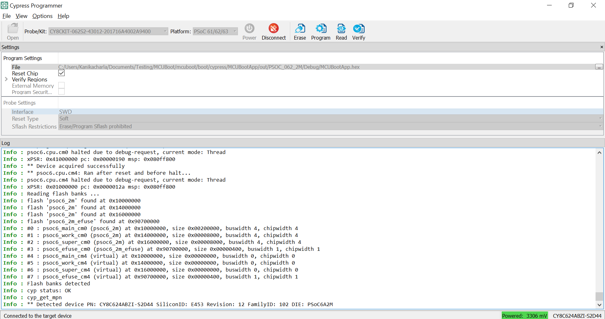

6. After programming, the bootloader starts automatically. Confirm that the UART terminal displays:

    **Figure 3. Booting with no bootable image**

    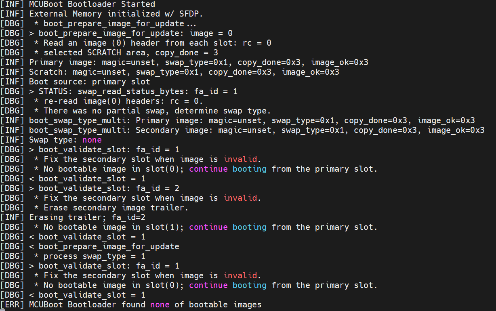

---

## Operation

### Battery Service

1. Connect the board to your PC using the provided USB cable through the KitProg3 USB connector.

2. Use your favorite serial terminal application and connect to the KitProg3 COM port. Configure the terminal application:

    Baud rate: 115200 bps; Data: 8 bits; Parity: None; Stop: 1 bit; Flow control: None; New line for receive data: Line Feed(LF) or Auto setting

3. Program the board using one of the following:

    <details><summary><b>Using VSCode Tasks</b></summary>

    1. Open VSCode's Command Palette (`Cmd/Ctrl + Shift + P`)
    2. Select **Tasks: Run Task**
    3. Select **Program Debug** or **Program Release**
     </details>

    <details><summary><b>Using CLI</b></summary>

    From the terminal, execute the `make program` command:

    ```bash
    make program TOOLCHAIN=GCC_ARM
    ```

    </details>

After programming, the application starts automatically. Observe the messages on the UART terminal.

#### **Test using the AIROC&trade; Bluetooth&reg; Connect mobile app**

1. Turn ON Bluetooth&reg; on your Android or iOS device.

2. Launch the AIROC&trade; Bluetooth&reg; Connect app.

3. Press the reset switch on the kit to start Bluetooth&reg; LE advertisements. The red LED (LED1) starts blinking to indicate that advertising has started. Advertising will stop after 120 seconds if a connection has not been established.

4. Swipe down on the AIROC&trade; Bluetooth&reg; Connect app home screen to start scanning for Bluetooth&reg; LE peripherals; your device appears on the AIROC&trade; Bluetooth&reg; Connect app home screen. Select your device to establish a Bluetooth&reg; LE connection (see Figure 4). Once the connection is established, the user LED turns to 'always ON' state.

    **Figure 4. AIROC&trade; Bluetooth&reg; Connect app device discovery**

    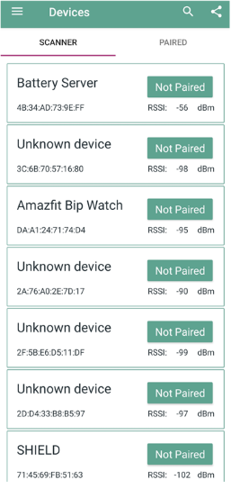

5. Select the Battery Service (see Figure 5) from the carousel view to check the battery levels. Tap **START NOTIFY** to get notifications of the changing battery levels:

    **Figure 5. AIROC&trade; Bluetooth&reg; Connect Battery Service tab**

    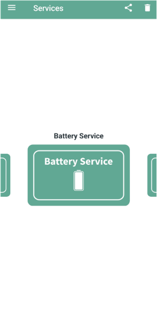

    **Figure 6. Battery level**

    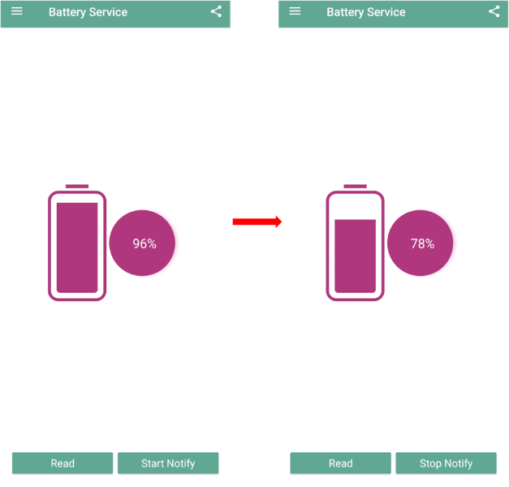

6. A notification is issued every 1 second, and the value is reduced by 2.

7. Use the KitProg3 COM port to view the Bluetooth&reg; stack and application trace messages in the terminal window. Note the application version.

    **Figure 7. Log messages on KitProg3 COM port**

    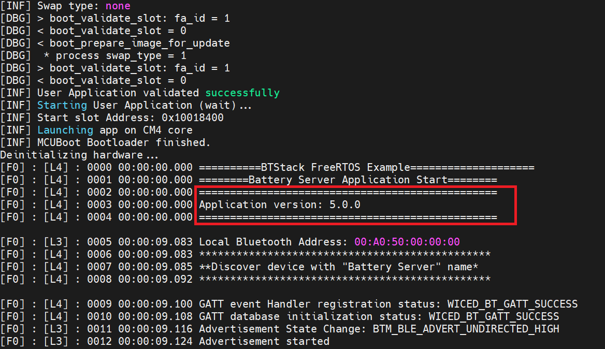

### OTA Update service

The app also supports OTA updates over Bluetooth&reg; LE. A peer app is used to push an updated image to the device. It can be downloaded from the [OTA peer apps repo](https://github.com/Infineon/btsdk-peer-apps-ota). This example uses the Windows app for pushing an OTA update image.

For preparing the OTA update image:

1. Modify the source code as desired (e.g., change the `BATTERY_LEVEL_CHANGE` define to change the battery drain rate)

2. Update the app version number in the Makefile by changing `OTA_APP_VERSION_MAJOR`, `MINOR VERSION`, and `OTA_APP_VERSION_BUILD`

3. Build the app, but **DO NOT PROGRAM**. This version will be used to push via the peer Windows app (_WsOtaUpgrade.exe_).

4. In the project directory, navigate to _build/\<TARGET>/\<Config>_ and locate the _.bin_ file. Copy this file to the same directory as _WsOtaUpgrade.exe_.

5. Open the terminal and navigate to _WsOtaUpgrade.exe_. Initiate the update:

    ```
    ./WsOtaUpgrade.exe <App_name>.bin
    ```

6. Select your device and click **OK**, then click **Start** to begin the OTA update.

    **Figure 8. WsOtaUpgrade app**

    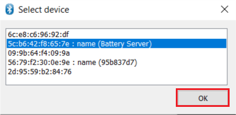

    **Figure 9. WsOtaUpgrade app start**

    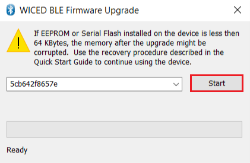

    Monitor the progress via the progress bar or device terminal.

    **Figure 10. WsOtaUpgrade progress bar**

    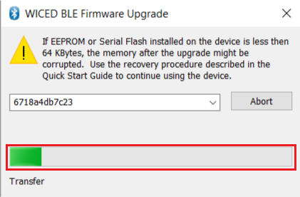

    **Figure 11. Download progress display on the terminal**

    

    Once the download is completed, the device will reboot. MCUboot either copies the new image over to the primary slot or swaps the images based on the flashmap used.

    **Figure 12. MCUboot reboot on download finish**

    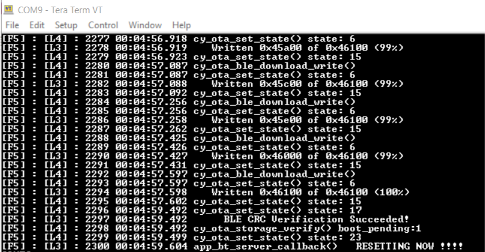

7. Observe the terminal for upgrade logs. Notice the updated app version once the app is launched by MCUboot.

    **Figure 13. Updated app with faster rate of change of battery level**

    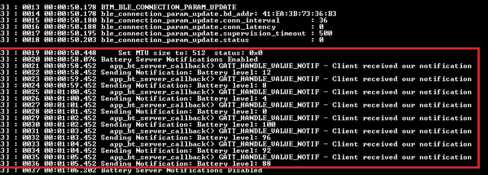

### Revert OTA update image

To test the revert feature of MCUboot, create and send a 'bad' image as an OTA update. The bad image does not call `cy_ota_storage_validated()`; instead it prints a banner message and issues a soft reset. Upon reboot, MCUboot reverts to the previously validated image.

1. Edit the Makefile and add `TEST_REVERT` to the `Defines` variable:

    ```
    DEFINES+=CY_RETARGET_IO_CONVERT_LF_TO_CRLF CY_RTOS_AWARE TEST_REVERT
    ```

2. Update the app version in the Makefile. Build the app, but **DO NOT PROGRAM**.

3. Use _WsOtaUpgrade.exe_ to push the OTA update image to the device.

4. After reset, MCUboot will update to the new image. After the update, a banner is printed and a soft reset is issued. MCUboot then reverts to the 'good' image.

    **Figure 14. MCUboot reverting the image**

    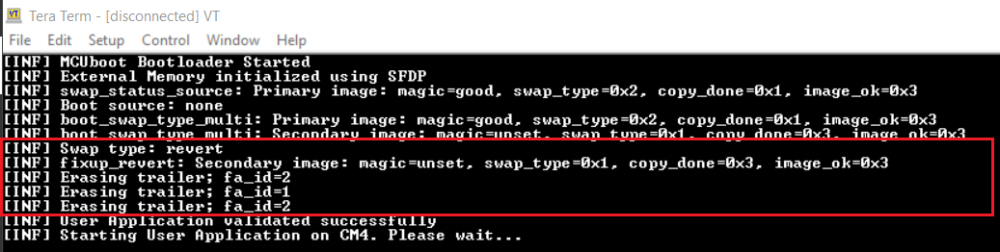

---

## Debugging

You can debug the example to step through the code.

<details><summary><b>In VSCode</b></summary>

After running `./setup-vscode.sh`, use the provided launch configuration:

1. Open the Run and Debug panel (`Cmd/Ctrl + Shift + D`)
2. Select the appropriate debug configuration
3. Press F5 to start debugging

</details>

<details><summary><b>In Eclipse IDE</b></summary>

Use the **\<Application Name> Debug (KitProg3_MiniProg4)** configuration in the **Quick Panel**. For details, see the [Eclipse IDE for ModusToolbox&trade; user guide](https://www.infineon.com/MTBEclipseIDEUserGuide).

> **Note:** **(Only while debugging)** On the CM4 CPU, some code in `main()` may execute before the debugger halts at the beginning of `main()`. This means that some code executes twice – once before the debugger stops execution, and again after the debugger resets the program counter to the beginning of `main()`. See [KBA231071](https://community.infineon.com/docs/DOC-21143) to learn about this and for the workaround.

</details>

---

## Design and implementation

The code example has two main services:

-   **Bluetooth&reg; LE GATT Server for Battery Service**

    Battery Service simulates the battery level, which changes continuously from 100 to 0 percent in steps defined by the `BATTERY_LEVEL_CHANGE` macro. It has a default value of 2 percent. On a periodic timer, notifications are sent to the client.

    In the C++ implementation, this is handled by:

    -   `battery_service_task` - FreeRTOS task that updates and sends battery level notifications
    -   `ble_context` - Manages BLE connections and GATT operations

-   **OTA Firmware Upgrade Service**

    The OTA Firmware Upgrade Service enables updating the application image remotely. A peer app on Windows can be used to push an OTA update to the device.

    The `ble_context` class manages OTA operations through:

    -   `ota_agent_initialize()` - Initialize and start the OTA agent
    -   `ota_agent_write_handler()` - Handle GATT write requests for OTA operations
    -   `ota_agent_confirmation_handler()` - Handle OTA operation completion

    **Figure 15. OTA image transfer sequence**

    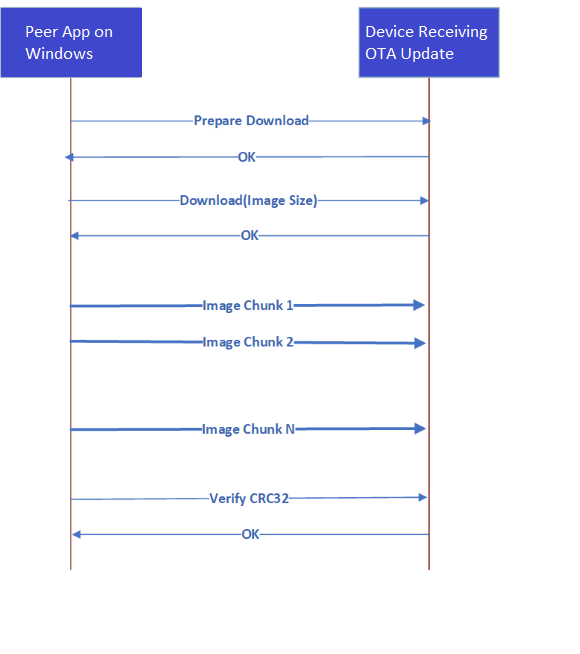

    > **Note:** The thin lines in this diagram correspond to the messages sent using the Control Point characteristic. Thick lines indicate messages sent using the Data characteristic.

---

## Related resources

| Resources                 | Links                                                                                                                                                                                                                                                                                                                                                                                                                                                                                                                                                              |
| ------------------------- | ------------------------------------------------------------------------------------------------------------------------------------------------------------------------------------------------------------------------------------------------------------------------------------------------------------------------------------------------------------------------------------------------------------------------------------------------------------------------------------------------------------------------------------------------------------------ |
| Original Infineon Example | [mtb-example-btstack-freertos-battery-server](https://github.com/Infineon/mtb-example-btstack-freertos-battery-server)                                                                                                                                                                                                                                                                                                                                                                                                                                             |
| Application notes         | [AN228571](https://www.infineon.com/AN228571) – Getting started with PSOC&trade; 6 MCU on ModusToolbox&trade; <br> [AN215656](https://www.infineon.com/AN215656) – PSOC&trade; 6 MCU: Dual-CPU system design <br> [AN210781](https://www.infineon.com/AN210781) – Getting started with PSOC&trade; 6 MCU with Bluetooth&reg; Low Energy connectivity on PSOC&trade; Creator                                                                                                                                                                                        |
| Code examples             | [Using ModusToolbox&trade;](https://github.com/Infineon/Code-Examples-for-ModusToolbox-Software) on GitHub                                                                                                                                                                                                                                                                                                                                                                                                                                                         |
| Device documentation      | [PSoC&trade; 6 MCU datasheets](https://documentation.infineon.com/html/psoc6/bnm1651211483724.html) <br> [PSOC&trade; 6 technical reference manuals](https://documentation.infineon.com/html/psoc6/zrs1651212645947.html)                                                                                                                                                                                                                                                                                                                                          |
| Libraries on GitHub       | [mtb-pdl-cat1](https://github.com/Infineon/mtb-pdl-cat1) – PSOC&trade; 6 Peripheral Driver Library (PDL) <br> [mtb-hal-cat1](https://github.com/Infineon/mtb-hal-cat1) – Hardware Abstraction Layer (HAL) library <br> [retarget-io](https://github.com/Infineon/retarget-io) – Utility library to retarget STDIO messages to a UART port <br> [freeRTOS](https://github.com/Infineon/freertos) – freeRTOS library and docs <br> [bluetooth-freeRTOS](https://github.com/Infineon/bluetooth-freertos) – WICED Bluetooth&reg;/Bluetooth&reg; LE host stack solution |
| Middleware on GitHub      | [psoc6-middleware](https://github.com/Infineon/modustoolbox-software#psoc-6-middleware-libraries) – Links to all PSOC&trade; 6 MCU middleware                                                                                                                                                                                                                                                                                                                                                                                                                      |
| Tools                     | [ModusToolbox&trade;](https://www.infineon.com/modustoolbox) – ModusToolbox&trade; software is a collection of easy-to-use libraries and tools enabling rapid development with Infineon MCUs                                                                                                                                                                                                                                                                                                                                                                       |

---

## Document history

Document title: _Bluetooth&reg; LE Battery Server with OTA update (C++ Implementation)_

| Version | Description of change                                                 |
| ------- | --------------------------------------------------------------------- |
| 1.0.0   | C++ rewrite of Infineon's mtb-example-btstack-freertos-battery-server |

<br>

---

## Credits

Based on [CE230299 – Bluetooth&reg; LE Battery Server with OTA update](https://github.com/Infineon/mtb-example-btstack-freertos-battery-server) by Infineon Technologies.

All referenced product or service names and trademarks are the property of their respective owners.
The Bluetooth&reg; word mark and logos are registered trademarks owned by Bluetooth SIG, Inc., and any use of such marks by Infineon is under license.
