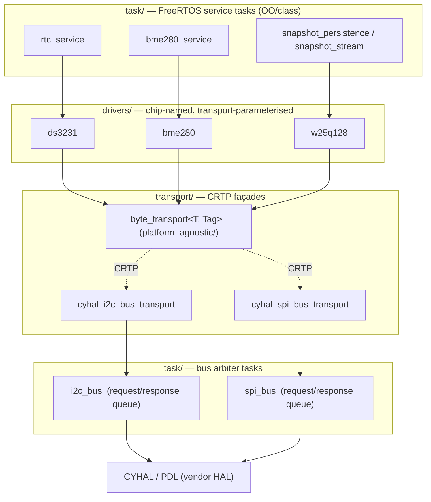
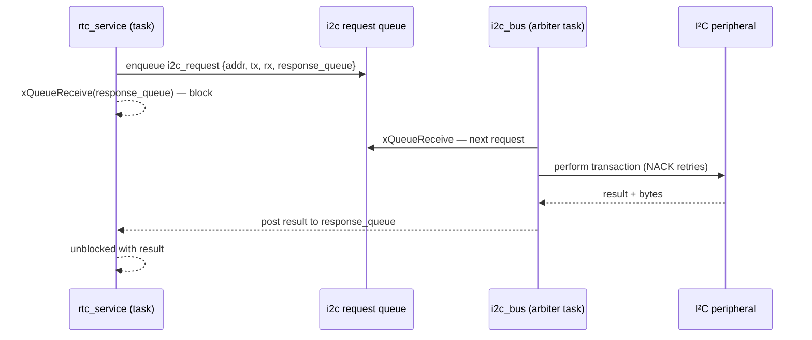
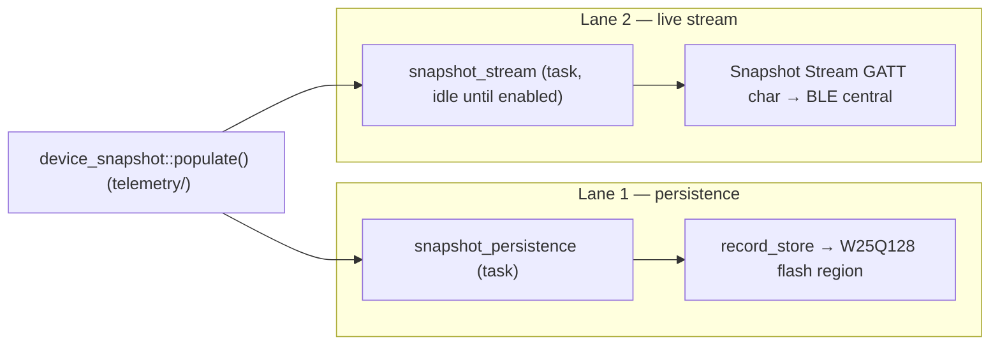
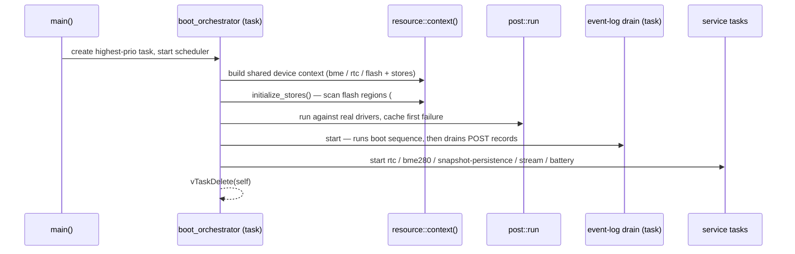

# `Sentinel/src` — source tree map

Top-down orientation for the firmware. Every module below is a directory you can
open on GitHub; this page is the **table of contents** and holds the core
architectural diagrams. For the *why* behind design choices, follow the links
into [`docs/architecture/`](../../docs/architecture/) (cumulative decisions,
repo layout). For per-function API detail, generate the Doxygen reference
(`doxygen Doxyfile` → `docs/doxygen/`).

> **Reading order for newcomers:** [Boot](#boot--the-orchestrator) → the
> [layered picture](#the-layered-picture) → the module you care about below.

---

## Module map

| Module | What it is | Key types / entry points |
|---|---|---|
| [`app/`](app/) | Production boot orchestrator — the one highest-priority task that brings the system up, then self-deletes. | `app::boot_orchestrator` |
| [`resource/`](resource/) | Process-wide shared state: the device context (drivers + stores) and BSP/system bring-up. | `resource::context()`, `resource::system_initialize()`, `create_orchestrator()` |
| [`drivers/`](drivers/) | Chip-named device drivers, one subdir per part. Pure logic, parameterised over a transport. | `w25q128`, `ds3231`, `bme280`, `psoc6_die_temperature`, `led_pwm`, `tachometer` |
| [`transport/`](transport/) | CRTP transport façades: a platform-agnostic base + CYHAL implementations. The seam that makes drivers portable. | `byte_transport<T, Tag>`, `cyhal_*_transport`, `cyhal_*_bus_transport` |
| [`task/`](task/) | Every FreeRTOS task, OO/class style (decision #16). Bus arbiters + per-subsystem service tasks. | `i2c_bus`, `spi_bus`, `*_service`, `snapshot_*`, `ble_maintenance` |
| [`storage/`](storage/) | Flash-backed + RAM circular record stores — the persistence primitive. | `record_store`, `ram_record_store` |
| [`diagnostics/`](diagnostics/) | Power-on self test and the flash-backed System Event Log. | `post`, `system_event_log`, `system_event` |
| [`telemetry/`](telemetry/) | The packed `device_snapshot` struct and its `populate()`. | `device_snapshot` |
| [`bluetooth/`](bluetooth/) | BLE stack context + the GATT accessor layer over the generated DB. Chip-named services. | `ble_context`, `ble_gatt`, `gatt_*` |
| [`logging/`](logging/) | Unified logging facade — one call routes to serial + the BLE debug stream. | `log`, `logi`/`loge`, `log_sink`, `debug_print` |
| [`utilities/`](utilities/) | Header-only helpers: spans, ring buffers, endianness, version/platform IDs. | `span`, `ring_buffer`, `firmware_version`, `platform_id` |
| [`test/`](test/) | Run-to-completion testbench suites, one per subsystem (drive **real** components — decision #15). | `test::<subsystem>::run_all()` |
| [`testbench/`](testbench/) | The bottom-up test orchestrator (twin of the boot orchestrator). | `test_orchestrator` |

*Directories without a dedicated `README.md` yet are still browsable above; the
per-module narrative pages land incrementally (issue #57).*

---

## The layered picture

Drivers never touch the HAL directly. They speak to a **CRTP transport façade**,
so the same driver logic runs over a CYHAL bus on the PSoC 6 today and over a
POSIX/Linux bus later (Phase III) by swapping the template argument — no `#ifdef`
in the driver.

`byte_transport<Derived, Tag>` is the static-polymorphism base (`i2c_tag` /
`spi_tag`); each `cyhal_*_bus_transport` derives from it and routes calls to a
bus-arbiter task rather than driving the peripheral inline. See
[`transport/`](transport/) and [`docs/architecture/decisions.md`](../../docs/architecture/decisions.md)
(#26 CRTP base, #27/#28 bus arbiters).

---

## Bus arbiter task model

A single peripheral (one I²C bus, one SPI bus) is shared by several driver
consumers on different tasks. Each bus is owned by **one arbiter task**;
consumers enqueue a request and block on their own response queue, so bus
access is serialized without every caller holding a peripheral lock.

The SPI bus (`spi_bus`, driving the W25Q128) follows the identical pattern with
a per-device chip-select. See [`task/`](task/).

---

## Two-lane snapshot model

`device_snapshot` (packed telemetry) is produced on two independent lanes
(decision #14): **lane 1** persists periodic snapshots to flash for history;
**lane 2** streams live snapshots over BLE only while a subscriber is enabled.

Lane 1 is `[0x180000..0x280000)` on the flash map, ~5-min cadence; lane 2 is
~100 ms while enabled. See [`task/`](task/), [`telemetry/`](telemetry/),
[`storage/`](storage/).

---

## Boot — the orchestrator

`main()` is thin: it starts the scheduler and the boot orchestrator, a single
highest-priority task that builds the world in order, then deletes itself. All
function-local statics are first-touched here (single-task, so
`-fno-threadsafe-statics` is safe — decision #18).

A BLE-stack failure no longer hard-asserts — POST records it and boot proceeds
degraded (decision #12). See [`app/`](app/), [`resource/`](resource/),
[`diagnostics/`](diagnostics/), and
[`docs/architecture/decisions.md`](../../docs/architecture/decisions.md).

---

## See also

- [`docs/architecture/decisions.md`](../../docs/architecture/decisions.md) — cumulative architectural decisions (#1–#18…).
- [`docs/architecture/repo-layout.md`](../../docs/architecture/repo-layout.md) — repo-level source tree map.
- [`docs/architecture/hardware-bench.md`](../../docs/architecture/hardware-bench.md) — board, bus pinouts, build/flash quick reference.
- [`docs/SESSION_HANDOFF.md`](../../docs/SESSION_HANDOFF.md) — rolling status for contributors joining mid-stream.
